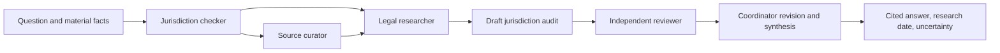

# Australian Legal Research Agent Skills

A portable, instruction-native package for rigorous Australian legal research across Codex, ChatGPT, and compatible Agent Skills hosts. It is designed for lawyers, legal researchers, administrators, compliance teams, and developers who need inspectable workflows rather than an opaque legal-answer bot.

The package conducts jurisdiction-aware research, prioritises current official sources, separates law from guidance, exposes uncertainty, and subjects substantive work to an independent review. Its initial depth is Australian corporations, corporate, employment, and workplace law, while the method extends to other Australian fields.

It provides legal research information and workflow assistance. It does not act as a solicitor, create a solicitor–client relationship, guarantee a definitive result, or replace tailored advice for a high-risk decision.

## Architecture



| Skill | Role | Use it independently when |
|---|---|---|
| `australian-jurisdiction-checker` | Maps Commonwealth, state, territory, national, applied, and overlapping regimes | The main problem is coverage, territorial reach, or missing jurisdiction facts |
| `australian-legal-source-curator` | Plans and assesses authoritative sources | You need preferred official repositories, source quality, or a currency method |
| `australian-legal-research` | Produces an evidence-backed draft | Jurisdiction and sources are known or can be developed, and independent approval will follow |
| `australian-legal-reviewer` | Challenges a completed draft and evidence bundle | You need an independent pass/fail decision and defects exposed |
| `australian-legal-research-team` | Coordinates intake through reviewed final synthesis | The request needs an end-to-end substantive answer or memorandum |

The reviewer is deliberately separate from the researcher. It verifies proposition support, jurisdiction, currency, case treatment, contrary authority, citation traceability, and confidence rather than simply improving prose.

## Install and test in Codex

The canonical source lives in [`skills/`](skills/). Codex's documented repository-scoped discovery path is `.agents/skills`; its documented personal path is `~/.agents/skills`. To avoid divergent copies, use symlinks:

```sh
mkdir -p .agents/skills
for skill in skills/*; do ln -sfn "../../$skill" ".agents/skills/$(basename "$skill")"; done
```

For a personal installation, symlink each absolute skill directory into `~/.agents/skills/`. Do not commit the local `.agents/skills` links unless the repository adopts them as its installation mechanism.

In Codex CLI or IDE, select a skill through `/skills`, mention it with `$skill-name`, or describe a task that clearly matches its metadata. Example prompts:

```text
$australian-legal-research-team What statutory and common law obligations may apply to a redundancy affecting an employee working in Queensland?
$australian-jurisdiction-checker Which employment law jurisdictions may apply to an employee working remotely from New South Wales for a Victorian employer?
$australian-legal-source-curator Identify the preferred official sources for checking the current status of a Commonwealth Act and associated regulations.
$australian-legal-reviewer Review this draft for incorrect jurisdiction, outdated legislation and unsupported conclusions.
```

Implicit selection should choose a specialist for a narrow request and the team only for an end-to-end researched answer. See [`tests/trigger-tests.md`](tests/trigger-tests.md).

## Research principles

- Australia is not one undifferentiated jurisdiction. Test Commonwealth, every connected state or territory, national/referral schemes, public-sector and local exceptions, applied and model laws, overlap, and cross-border facts.
- Prefer authorised legislation, official judgments and tribunal material, then official regulator and parliamentary sources. Treat AustLII as an invaluable but generally unofficial discovery and republication service.
- State the research date; verify in-force status, compilation, amendments, commencement, transitions, repeal/expiry, and later case or legislative treatment.
- Trace every material legal proposition to a source and pinpoint. Never manufacture statutory wording, citations, quotations, case names, or URLs.
- Label regulator guidance, explanatory material, commentary, and law-firm articles by status. Seek contrary authority.
- Use high, moderate, or preliminary/low confidence and explain missing facts, unsettled law, unavailable sources, and other limits.

## Cross-platform use

The five directories follow the open Agent Skills format: a `SKILL.md` with `name` and `description`, plus references loaded as needed. OpenAI describes Agent Skills as available across ChatGPT desktop and Codex surfaces, subject to product rollout and workspace controls. For team distribution in ChatGPT Work and Codex, package the five skills as an OpenAI plugin; see [`distribution/plugin-plan.md`](distribution/plugin-plan.md).

Hermes documents compatible progressive loading for local skills but uses different installation and plugin systems. Keep these canonical skill files unchanged and follow [`distribution/hermes.md`](distribution/hermes.md) for an audited copy/symlink or thin adapter. An OpenAI plugin must not be presented as directly installable in Hermes.

## Evaluations

[`tests/test-cases.yaml`](tests/test-cases.yaml) defines 18 positive, negative, current-law, jurisdiction, source-quality, and adversarial review cases. Run the manual protocol in [`tests/README.md`](tests/README.md), record outputs, and assess them against:

- trigger accuracy;
- jurisdiction accuracy;
- source authority and citation traceability;
- legal currency;
- reviewer independence;
- uncertainty handling and usefulness; and
- unnecessary agents or tools.

No Python launcher is required. The package depends on the host's file-reading, web-research, and optional subagent capabilities.

## Development

Work on a branch, preserve small reviewable commits, never force-push, and run the validation commands in [`tests/README.md`](tests/README.md) before completion. Contributions should update source verification dates, explain authority/status changes, add or revise evaluations for changed behaviour, and preserve the five-role separation. Do not add executable code unless it performs a necessary deterministic operation and is tested and documented.

The project is in an initial native-skills rebuild and requires human legal review before production reliance. Known limits include variable host tooling, incomplete publication of some decisions, changing official sites, no mandatory commercial-database access, and the fact-sensitive nature of jurisdiction and legal application.

Licensed under the [MIT License](LICENSE).
